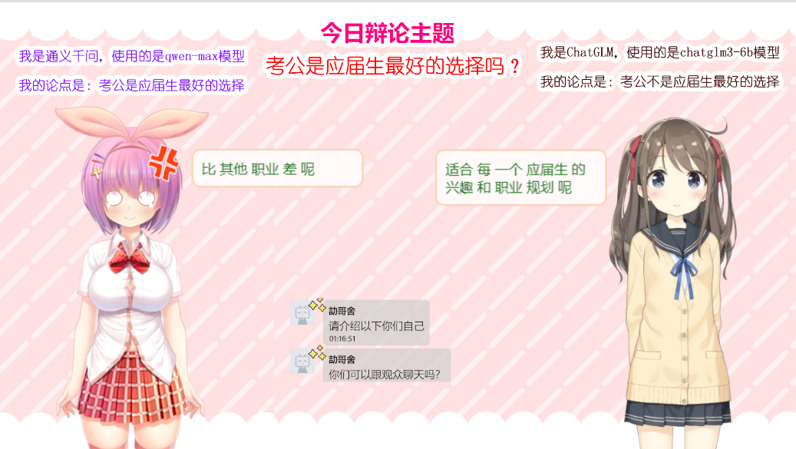

# AI TalkShow

一个基于AI的直播间项目，支持单个AI或多个AI实时通过弹幕进行互动交流。



## 功能特点

- 支持多个AI模型（ChatGLM、通义千问等）
- 实时语音合成
- 自动字幕生成

## 系统要求

- Python 3.8+
- 支持CUDA的GPU（推荐）
- 足够的磁盘空间用于模型缓存

## 安装

1. 克隆仓库：
```bash
git clone https://github.com/yourusername/ai-talkshow.git
cd ai-talkshow
```

2. 安装依赖：
```bash
pip install -r requirements.txt -i https://mirrors.aliyun.com/pypi/simple/ --trusted-host https://mirrors.aliyun.com
```

3. 配置环境变量：
```bash
export QWEN_API_KEY="your-api-key"
export QWEN_API_KEY=""
export BILIBILI_SESSION="your-session"  # 可选
```

## 配置

编辑 `config/config.yaml` 文件进行配置：

```yaml
bilibili:
  live_room_ids: [23679394]
  session: ""  # 从环境变量BILIBILI_SESSION获取

models:
  chatglm:
    model_path: "path/to/chatglm/model"
    server:
      host: "127.0.0.1"
      port: 8000
  qwen:
    api_key: ""  # 从环境变量 QWEN_API_KEY 获取
    model: "qwen-plus-0112"

tts:
  voices:
    ai1: "zh-CN-XiaoxiaoNeural"
    ai2: "zh-CN-XiaoyiNeural"
  media_path: "tmp"
  vtt_path: "tmp"

debate:
  max_turns: 5
  topics:
    main: "考公是应届生最好的选择吗？"
    ai1: "考公是应届生最好的选择！"
    ai2: "考公并不是应届生最好的选择！"
```

## 使用方法

1. 启动程序：
```bash
./scripts/start.sh
```

2. 停止程序：
```bash
./scripts/stop.sh
```

## 项目结构

```
ai-talkshow/
├── src/
│   ├── core/                 # 核心功能模块
│   ├── models/              # AI模型实现
│   ├── services/            # 服务层
│   └── utils/               # 工具类
├── config/                  # 配置文件
├── tests/                   # 测试目录
├── scripts/                 # 脚本目录
└── requirements.txt         # 项目依赖
```

## 开发计划

- [ ] 支持B站字幕互动

## 贡献

欢迎提交Issue和Pull Request！

## 许可证

MIT License